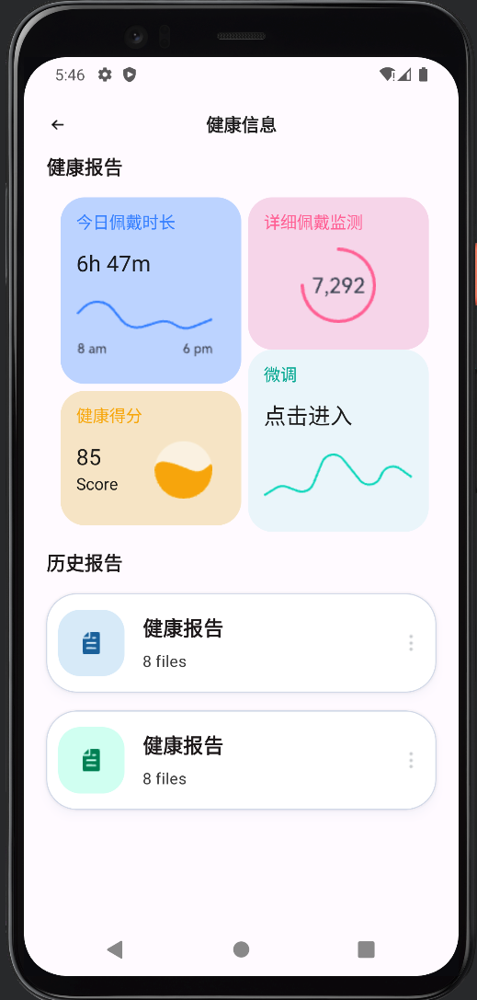

  
  <h3><code>易态</code></h3>
  
<em>个性化脊柱矫形系统</em>

  
  

 

 

## Tech Stack
- Jetpack Compose
- Okhttp 3
- Material 3
- Hilt

> 目前只实现UI页面和Iot功能

## 📷 Screenshot 
### 登录页

  <figure class="third">
      
  </figure>

### 普通端
|  |  |  |  | 
|:-----------------------------------------------------:|:--------------------------------------------------------------:|:-----------------------------------------------------------:|:-------------------------------------------------------:|
|                         商城 	                          |                              通知 	                              |                            社区 	                             |                          个人 	                           |

### 医师端

|  |  |  |  |  |
|:--------------------------------------------------------:|:----------------------------------------------------------:|:--------------------------------------------------------------:|:--------------------------------------------------------:|:--------------------------------------------------------:|
|                           设备 	                           |                           设备调整 	                           |                             健康报告 	                             |                          初步建模 	                          |                          病例数据库                           |

## ⚖️ License

[GPL](LICENSE)

